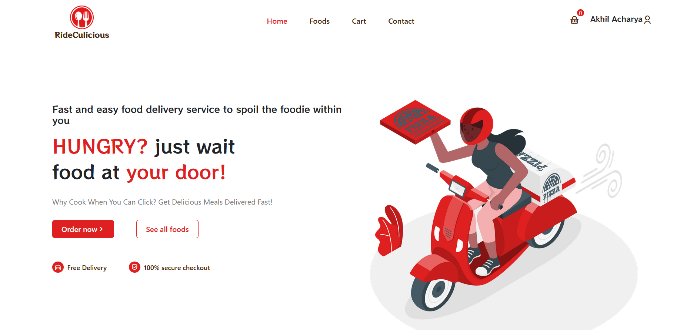
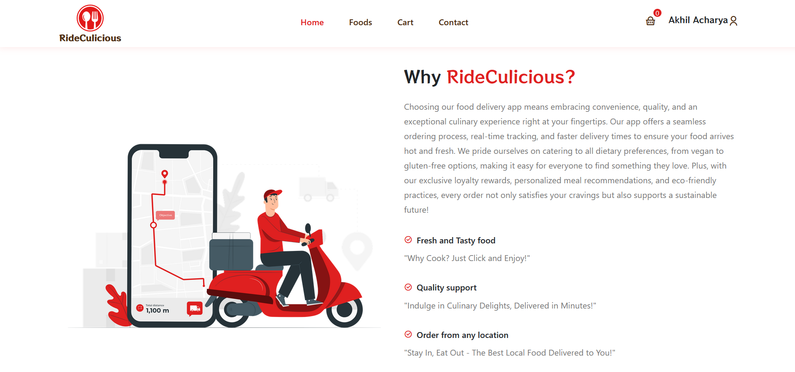
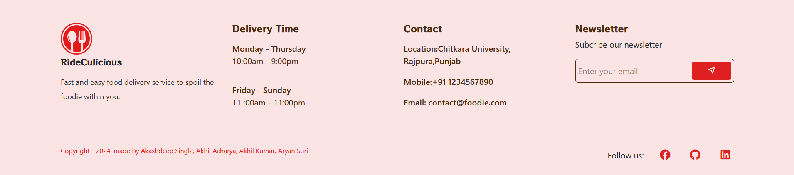
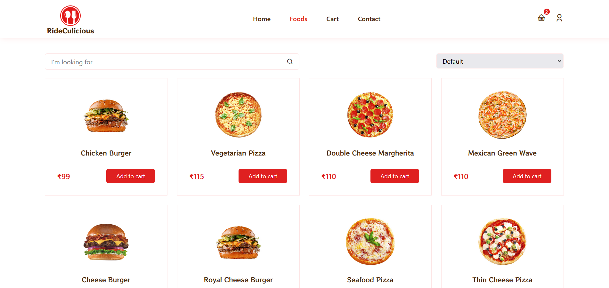
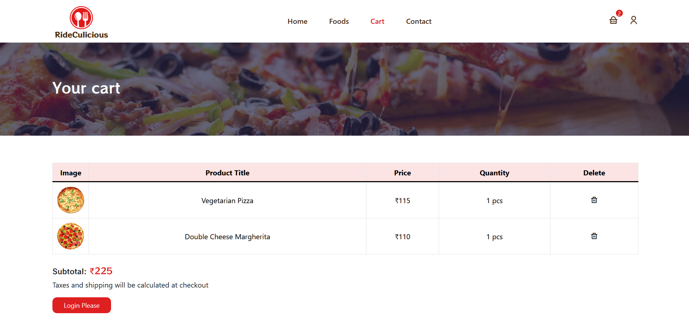
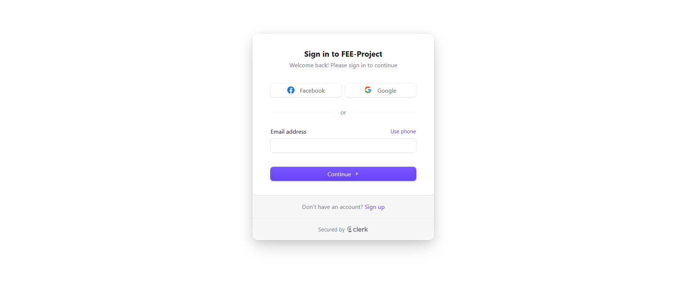

# RideCulicious - Food Delivery Web 🍕 🍔

RideCulicious is a project built from React JS, Redux Toolkit, and styled responsively by Bootstrap, CSS, Reactstrap. This website was built as a food delivery website which was guided by Coding With Munhib.

## Visuals

## Technology use in the application

. ReactJS  
. Clerk Authentication   
. Bootstrap, Reactstrap  
. CSS  
. React Route
